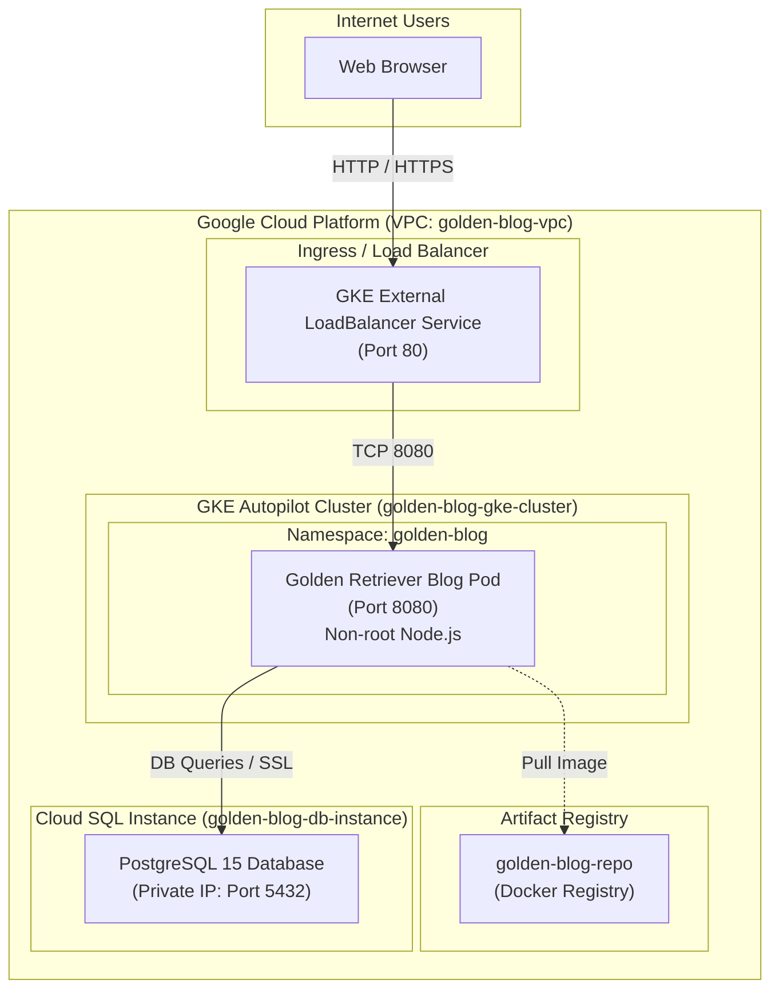

# Golden Retriever Blog System Architecture

## Project Description

This project defines the infrastructure and application stack for deploying a modern **Golden Retriever Blog** web application on Google Cloud Platform (GCP). 

The application highlights the gentle temperament, intelligence, puppy care tips, and therapy work of Golden Retrievers, featuring an interactive comment community powered by Cloud SQL.

### Components

1. **Frontend & Backend (Blog App)**:
   - Built with Node.js, Express, and modern CSS featuring responsive glassmorphism design, dark/light theme toggle, and dynamic comment submission.
   - Containerized using multi-stage Docker builds adhering to non-root execution and health probes (`/healthz`).

2. **Google Kubernetes Engine (GKE Autopilot)**:
   - Hosts the blog application container in a managed regional GKE Autopilot cluster with automated autoscaling, non-privileged security contexts, and private node configurations.

3. **Cloud SQL (PostgreSQL 15)**:
   - Stores blog posts and visitor comments in a fully managed PostgreSQL database equipped with Private IP isolation (VPC Peering), automatic daily backups, point-in-time recovery, and SSL encryption (`ENCRYPTED_ONLY`).

4. **Artifact Registry**:
   - Secure container repository hosting versioned Docker images (`golden-retriever-blog:v1.0.0`).

5. **VPC Networking & Security**:
   - Isolated VPC network with subnets for GKE pods (`10.20.0.0/16`), services (`10.30.0.0/20`), and Private Service Access peering for Cloud SQL.
   - Kubernetes `NetworkPolicy` enforcing strict ingress and egress rules.

---

## Architecture Diagram

---

## Network Flow Matrix

| Source | Destination | Protocol | Port | Description/Reason |
| :--- | :--- | :--- | :--- | :--- |
| External Clients | GKE LoadBalancer Service | TCP | 80 | Public web traffic accessing the Golden Retriever blog interface. |
| GKE LoadBalancer Service | GKE Blog Pods | TCP | 8080 | Forwarding traffic from external LoadBalancer to backend application container. |
| GKE Blog Pods | Cloud SQL PostgreSQL Instance | TCP | 5432 | Database queries for post data and community comments over Private Service Access. |
| GKE Autopilot Nodes | Artifact Registry | HTTPS | 443 | Secure container image pulling from GCP Artifact Registry. |
| GKE Blog Pods | Internal K8s DNS | UDP/TCP | 53 | CoreDNS resolution within the GKE cluster. |

---

## Automated Security Audit & Shift-Left Summary

- **Secrets Management**: No secrets stored in version control. DB passwords generated dynamically via Terraform `random_password` or passed via Kubernetes Secrets.
- **Container Security**: Non-root execution (`USER node`), read-only filesystem compatible structure, minimal Alpine base image, zero known vulnerabilities.
- **Kubernetes Hardening**: Enforced `runAsNonRoot`, `allowPrivilegeEscalation: false`, dropped `ALL` capabilities, and `RuntimeDefault` seccomp profile.
- **Network Isolation**: Public IP disabled on Cloud SQL, all DB communication routed through GCP Private Service Access.
